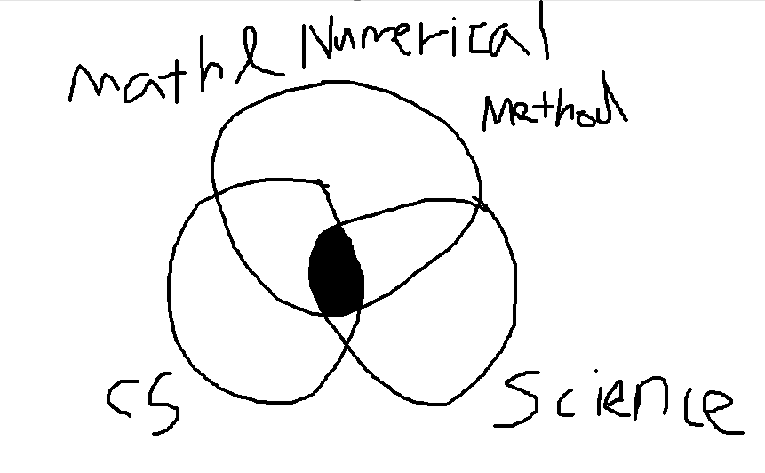

# CDS 130 Week 1 Key points

## The nature of Ethics
    A system of Principles
    Social function : Make everything smoothly, Make trust not to break business trasaction.
    top 4 values - truth, honesty, fairness, equity
    mechanism : choices -> comsequences -> responsibility

    Especailly Ethics for professionals -> Confidentiality, public safety and trust

## What is CDS?

Computationl sciecne is the intersection of science, mathematics, and computer science to solve problem and get insight through them. 
So, First of all, we can find problem situation from science. And, change the scientific situation to mathmatics.(F=ma ->  Differentiation)  
Next, Computer can not understand the process of differentiation. It is just a simple caculation. So, we should change this things to simple ones. 
it is numerical methods. Through this situation, it is changed as the algorithm which can be calculated by computer.   Finally we use computer with R, Matlab etc. 
It is computational science. We make simulations with computer. Also, during the simulation, there occurs many raw datas.  So we visualize that for analyzing.  
It is computational and "DATA" science. It's my major. 

## In situ vs  In silico
    In situ : Physical experiment
    In silico : A experiment made by computer
    Especially there are 4 cases which uses In silico.
      1. Expensive (10000 cars crash experiment)
      2. Dangerous (nuclear bombs)
      3. Impossbile (Universe)
      4. Theoretically Intractable(so complicated)
    1,2 is physically possible for human.
    3 is physically impossible for human.
    4 is physically possible for human, but it is practically impossbile.
## Computer
    
    computer uses binary numbers. 

    Kilo   2^10 byte, called as Thousand(it is not accurate)
    Mega   2^20 byte, called as Million
    Giga   2^30 byte, called as Billion
    Tera   2^40 byte, called as Trillion
    Peta   2^50 byte, called as Quadrillion
    Exa    2^60 byte, called as Quintillion

    Kilo is not 1000, but we called it routinely.

    program : data + commands -> process(if it is executed)

    file extension : for distinguishing file form. (such as .exe, .txt etc)

    .fig, .jpg, .bmp, .png (img file), .fig > .jpg (460:1)

    window drive letter system -> starts with C drive

## Data vs information

    Data : a collection of raw, indivisual facts that lacks contexts
    Information : Data + Context
    Ex) 7(data) + week is(context) = week(context of time) is 7

## Matlab

    Matlab          [Ease of Use]      
    Python/R (Scripting Language)       
    Java(Networking Language)
    C/C++,Fortran 
    Assembly
    Machine code    [Increasing program size]

    the merit of Matlab
    
    <Softer reason>
    Easier to learn
    Many community/tech support
    Widely used

    <Harder reason>
    Modern state=of-the-art numerical methods
    optimized for Science & Engineering calculations
    Excellent Graphics & visualization
    * Matrix operations are fast
    Lots of pakages

## Structured Programming
### Reason 
    1. Deleting spaghetti codes
    2. Code clarifing and organization
    
### Structure
    1. Sequence : Code executes from top to bottom.
    2. Iteration : Code can be repeated by For, while etc.
    3. Selection : Code will be selected by If.
    
### Result
    Immediate Reduction in buggy code.

## Computing Thinking 

    Thinking which Divide problems into steps which can execute for computers and make code.

    There are two steps

    1. Write programs in Matlab(Learning enough for using Matlab as a important tool)
    2. Matlab becomes the machanism to computational think about the world.

## Matlab interface and etc.

    Currnet Folder : It informs us current folder. 
    Workspace : It is clipboard of Matlab. We can find variables through this. 
    command window : We can show result thorugh this. And we can simply make a code with this. 
    Editor : A editor for making .m file.  
    .m name : alphabet, number, _ (O)
              -, space, korean, etc(X)
              First letter : Alphabet
              Case-sensitive
              Don't use reserved words.
    disp : We can print something you want. 

    
    
    

    
