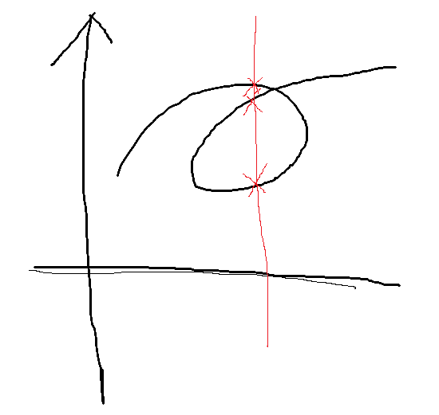
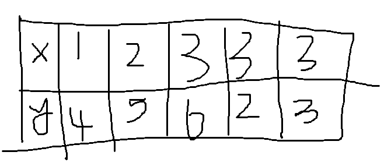
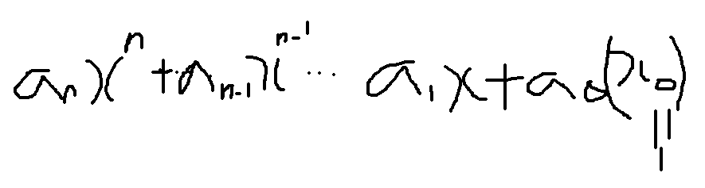

# Week 1 Key points

## fuctions
    fuction : relation from a set of inputs to a set of outputs and each input is connected to only one outputs
    domain : the set of all inputs
    codomain : the set of all possible output values (not output values)
    range : the set of output values
    
## Represention of fucntion (4 ways)
1. verbally (introduce fuction in words)
2. numerically (represent fuction through table)
3. visually (with graph)
4. algebraically(such as y=x+3)

  But, Not every table,graph, and equation defines fuctions.  
  this graph is not fuction. To know whether it's graph, you can write vertical line. if there are several lines it's not fuction.  
  Also, y^2=x is not fuction.  
  
  This is a example of table which is not fuction. There are 3 values of the same x=3.

## Many kinds of fuctions

1. even fuction : f(-x)= f(x), symmetric with respect to the y-axis.
2. odd fuction : f(-x) = -f(x),symmetric with respect to the orgin.
3. Polynomials : this type of fuction. constant is also polynomials.
(Linear is one of the types of Polynomials, degree=1)

4. Power fuctions : y=x^a(a is real number), if a is fraction, it is root fuction.  
5. Rational fuction : ratio of two polynomials. 
6. Algebraic fuctions: A fuction is only composed of addition, substraction, multiplication, division, root, and real power. 
7. Trigonomatic fuction : A fuction composed of Sin, Cos, tan etc. 
   * Sin and Cos are range from -1 to 1, and the period is 2ㅠ. 
8. Exponential fuction : the fuction formed as y=a^x (a>0, and a is not 1) 
   * if a<0, it exists imaginary number,  if a=0, some range is not defined, and if a=1, range is always 1. 
9. Logarithmic Function : the fuction formed as y=logbx (x>0, b>0, b is not 1) 

## New fuctions made by old fuctions
    if c>0 
    1. f(x)+c (shift up)  
    2. f(x)-c (down) 
    3. f(x-c) (move right) 
    4. f(x+c) (move left)
    5. cf(x) (stretch graph vertically)
    6. 1/c f(x) (shirnk graph vertically)
    7. f(cx) (shirnk graph horizontally)
    8. f(1/c x)(stretch graph horizontally)
    9. -f(x) (reflect graph about the x-axis)
    10. f(-x) (reflect graph about the y-axis)

