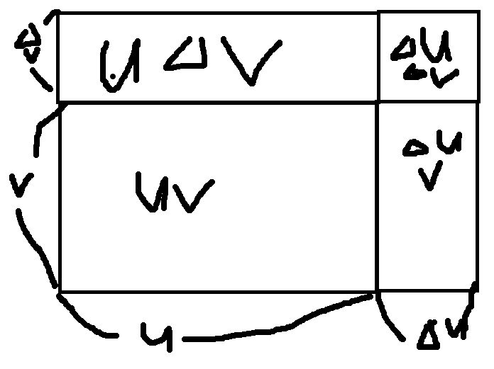

# Week5 key point

There are many generalized differentiation formula made by definition of derivative, limit law etc.

**if f(x)=c, f'(x)=0.**

**f(x)=x^n, f'(x)=nx^n-1. (if n is natural number.)**

**if f is differentiable at x, (cf(x))'=c f'(x)..**

proof : lim h->0 cf(x+h)-cf(x)/h = c lim h->0 (f(x+h)-f(x))/h (by limit law) = cf'(x)

**if f and g are differentiable at x, (f(x)+g(x))'=f'(x)+g'(x) (f(x)-g(x))'=f'(x)-g'(x)**

proof : lim h->0 (f(x+h)+g(x+h)-f(x)-g(x))/h = lim h->0 (f(x+h)-f(x))/h + lim h->0 (g(x+h)-g(x))/h (by limit law)

therefore it is same with f'(x)+g'(x).. This proof process is same when being subtraction formula.

if we differentiate exponential function, f'(x) = b^x * lim h->0 (b^h-1)/h (f'(0))

We define e as these two.

**1) lim n->infinity (1+1/n)^n (compound interest)**
   
**2) the number when f'(0) = 1 in exponential function.**

**Therefore, (e^x)'= e^x, also, (b^x)'= b^x * lnb**

**because b^x = (e^lnb)^x= e^(lnb*x) by chain rule,**

**e^(lnb*x) * lnb = b^x * lnb**

if f and g are differentiable at x, (f(x)*g(x))' = f(x)g'(x) + f'(x)g(x)

proof

we assume u=f(x), v=g(x) 

Δuv = (u+Δu)(v+Δv)-uv= uΔv + vΔu +ΔvΔu

lim Δx->0 Δuv/Δx = lim Δx->0 (uΔv/Δx + vΔu/Δx + ΔuΔv/Δx)

(∵v and u are differentiable & by limit law)

(ulimΔx->0 Δv/Δx) +(vlim Δx->0 Δu/Δx) + (Δu) * (lim Δx->0 Δv/Δx)

= u'v + v'u + 0 x v' = u'v + v'u

if f and g are differentiable at x,

(f(x)/g(x))' = (g(x)f'(x) - f(x)g'(x))/g(x)^2

proof :  u=f(x), v=g(x), Δ(u/v) = (u+Δu)/(v+Δv)-u/v = (vΔu-uΔv)/(v(v+Δv))

(u/v)' = lim Δx->0 (u/v)/Δx = lim Δx->0 ((v * Δu/Δx) - (u * Δv/Δx))/v(v+Δv)

 (∵v and u are differentiable & by limit law)

 = (v*u' - u*v')/v^2

 **f(x) and f'(x) are different function. Although f(x) is composition, f'(x) is not.**

 

    

    

    
