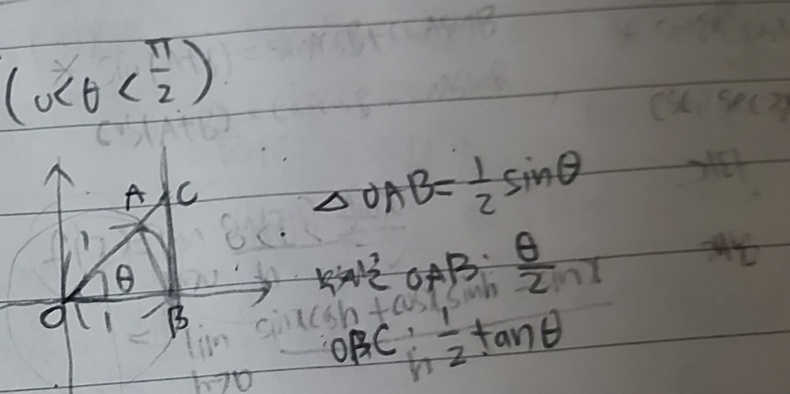
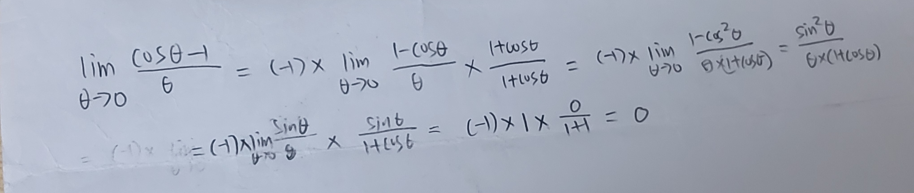

# Week 6 key point

## Derivative of Trigonometric function

First, **lim θ->0 sinθ/θ=1, lim θ->0 cosθ-1/θ=0**

### Sin proof

  

△oab = 1/2 sinθ, sector oab = θ/2, △obc= 1/2 tanθ

sinθ/2 < θ/2 < tanθ/2

sinθ < θ< tanθ

dividing by sin -> 1 < θ/sinθ < 1/cosθ

changing it to the reciprocal -> cosθ < sinθ/θ < 1

by squeeze theorem, lim θ->0 cosθ=1. limθ->0 1=1 therefore, lim θ->0 sinθ/θ = 1

### Cos proof

  

### Others

By, Angle addition formulas & above formulas,

d/dx (sinx) = cosx 

d/dx (cosx) = -sinx

And, sec x = 1/cos x , cec x = 1/sin x , cot x = 1/tan x

d/dx(tanx) = (sinx/cosx)' , by quotient rule,

(cos^2 x + sin^2 x) / (cosx)^2 = (1/cosx)^2 = (secx)^2

