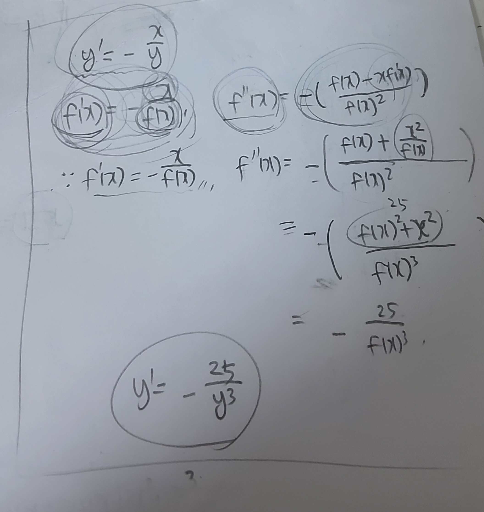

# Week7 key point

## Things to know before

**if f is continuous at a, and g is continuous at f(a),**

**g(f(a)) is continuous at a. (the domain can be point, close interval and open interval).** 

**if f is derivative at a, and g is derivative at f(a),**

**g(f(a)) is derivative at a. (the domain can be open interval)**

## Chain rule

**if g is derivative at a, and f is derivative at f(a),**

F(x) = f(g(x)), F'(x) = f'(g(x)) * g'(x)

## Two Notation Methods for Differentiation Formulas

There are two methods for representing differentiation rules.

First is Lagrange's notation.

It just uses f'(x) signal as derivative.

This way is widely used as it is intuitive and easy to use.

Second is Leibniz's notation.

For example, chain rule can be represented as dy/dx = du/dx * dy/du.

But, as Leibniz's notation just means random tangent line's horizontal and vertical delta,

we should assume the notation is in situation of the specific rule.

As they both mean the specific rule, if we prove either, another is also proved.

Mathematician realized it is hard to prove the rule using Leibniz's notation,

they proved it using Lagrange's notation and use both together.

They have own advantages and we can use them for each appropriate situation.

For example, we use chain rule's Lagrange's notation for just calculating and Leibniz's notation for related rates.

(It will deal with at week 8)

Lastly, we will analyze chain rule's Leibniz notation.

As I said before, we assume the notation is in the situation of the chain rule.

So, u means g(x) of f(g(x)). Therefore, like Lagrange's notation, substitute appropriate variable or

substitute its result made by x or y (ex: dy/dx : 3x+1), the situation becomes satisfied with original rule, and

the different two variable du (they are different. they are each x-u graph's vertical delta and u-y graph's horizontal delta)

becomes same and the result becomes same with Lagrange's notation.

It is proved as Lagrange's notation is previously proved.

Like this, other differentiation rules also have its Leibniz's notation. It is just another notation of the rule.

**But, the most important thing is the Leibniz's notation holds true only when original rule's condition is satisfied in the Leibniz's notation.**

## Implicit Differentiation

**Explicit function : the form of Dependent variable = the expression about Independent variable (it is not function, just form)**

**Implicit function : Other expression form about dependent variable and independent variable except explicit form. (it is also just form)**

The key point for resolving implicit differentiation is assuming 

there are differentiable function when we zoomed in the equation graph.

**ex1) x^2 + y^2 = 25 (it is not function, just equation)**

First, change y to f(x) (f(x) is assumed as differentiable function.)

x^2 + f(x)^2 = 25

we assume x^2+f(x)^2  as a new function (a(x)) because f(x) is already assumed as function.

25 is also function. (b(x))

Therefore, we consider that a(x) and b(x) are just each function which have y range.

As a(x) = b(x),  a'(x) = b'(x)

So, it is possible to do differentiation.

2x + 2f(x)f'(x) = 0 

f'(x) = - x / f(x)

It is condition for satisfying a'(x) = b'(x)

Ultimately, it is condition for satisfying a(x) = b(x)

If we consider this equation(a(x) = b(x)) as original equation,

for satisfying x^2 +  f(x)^2 = 25, f'(x) = -x/f(x) is the condition.

Therefore, we can know f'(x) = -x/f(x) if f(x) is differentiable function in equation.

f'(x) = -x/f(x) can be changed to y' = -x/y

In other words, simplifying the method, differentiate y like f(x) and simplify to y' = form.

**ex2)**

x^3 + y^3 = 6xy

3x^2 + 3y^2 y' = 6y + 6xy'

y' = (6y-3x^2)/(3y^2-6x)

### Detail about implicit derivative

Calculated y' holds true in every differentiable function in the equation.

However, as in the process when calculating f'(x), range which can not be differentiable is filtered by f'(x) results,

we can consider it like real derivative of equation although original equation is not function. (ex: x^2 + y^2 = 25)

So thanks to implicit derivative, we can calculate slope of equation although it it not function.

**Calculating y''**

**ex) x^2+y^2=25, y'= -x/y, y''=?**

we can consider y' and -x/y as just each x function.

So we can change it as f'(x) = -x/f(x) (condition : f'(x) and f(x) are differentiable and f(x) is not 0)

**problem solving**

  

