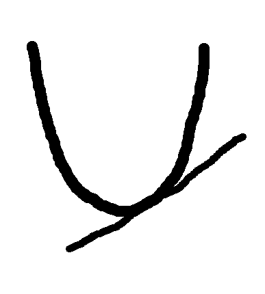
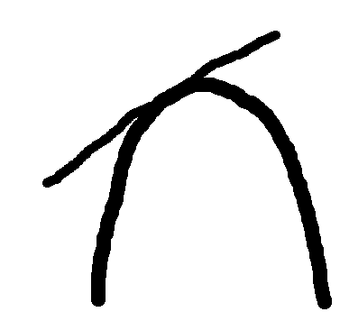

# Week9 key point

## Absolute maximum & minimum

Let c be a number in the domain D of a function f. 

Then, f(c)

absolute maximum value of f if f(c)>=f(x) for all x in D

absolute minimum value of f if f(c)<=f(x) for all x in D

## Local maximum & minimum

local maximum : f(c)

Condition

1. make open interval including c

2. the all elements of interval(x) should be f's domain

3. if by all x, f(c)>=f(x), f(c) is local maximum

(There only needs to be one or more intervals of this kind.)

local minimum : f(c)

Condition 

1. make open interval including c

2. the all elements of interval(x) should be f's domain

3. if by all x, f(c)<=f(x), f(c) is local minimum

(There only needs to be one or more intervals of this kind.)

**By this definition, end point can't be local maximum/minimum.**

## The Extreme Value Theorem

if f is continuous on [a,b], it always has absolute maximum & minimum value.

## Critical number

the points which have potential for being local maximum or minimum

Condition

1. f's domain

2. f'(x) = 0 or it is impossible to differentiate.

### The way for finding absolute maximum & minimum value.

potential point : end point & critical point -> compare them.

ex) f(x) = x^3-3x^2+1 (-1/2<=x<=4)

f(-1/2) = 1/8

f(4) = 17

critical number -> f'(x) = 3x^2-6x=0 -> 0,2

f(0) = 1

f(2) = -3

therefore, maximum = 17, minimum = -3

## Rolle's Theorem

1. f is continuous on [a,b]

2. f is differentiable on (a,b)

3. f(a) = f(b)

-> f'(c) =0, There exists at least one c.

## Mean value Theroem

1. f is continuous on [a,b]

2. f is differentiable on (a,b)

-> f'(c) = (f(b)-f(a))/(b-a), There exists at least one c.

## What f' tells us about the graph

f' means tangent line's slope.

f'(x) > 0 : tangent line's slope > 0 

f'(x) < 0 : tangent line's slope < 0 

f'(x) = 0 : tangent line's slope = 0

Also, the range when being f'(x)>0 and f'(x) should be open interval. it can not be just point.

But, the range when being f'(x) = 0 can not only interval but also point.

## First derivative test

The test using f' for checking whether critical number is local maximum/minimum point.

**if f is continuous**

f' changes + -> - at c, f(c) is local maximum

f' changes - -> + at c, f(c) is local minimum

## What f'' tells us about graph??

f'' means the derivative of f'.

Therefore, f'' > 0 -> the tangent slope of f increases as the f''>0 domain value increases

**Shape of graph**

 

-> The graph is always above the tangent line. This curve is concave upward.

if f'' <0 -> the tangent slope of f decreases as the f''>0 domain value increases

**Shape of graph**

 

-> The graph is always below the tangent line. This curve is concave downward.

the range of f''(x) > 0 & f''(x) <0 should be open interval, it can not be point.

f''(x) = 0 -> it can not only point but also interval.

if it is interval : f graph's tangent slope is same in the interval

if it is point : the point should be usual point or inflection point

## The second derivative test

The test using f'' for checking whether critical number is local maximum/minimum point.

1) f'(c) = 0, f''(c) > 0 -> f(c) is local minimum

2) f'(c) = 0, f''(c) < 0 -> f(c) is local maximum

