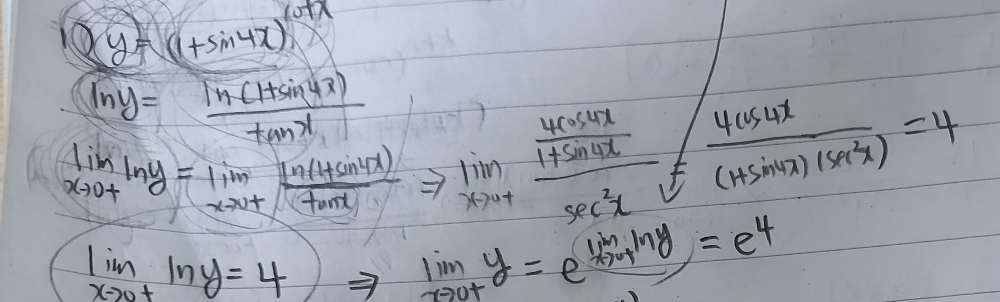
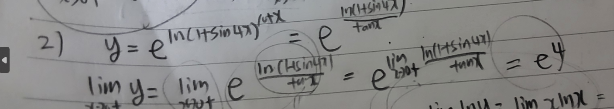
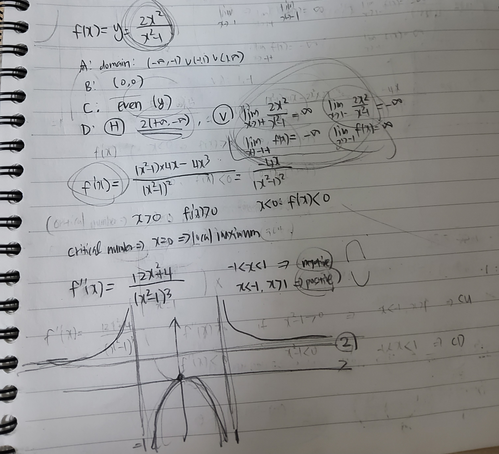
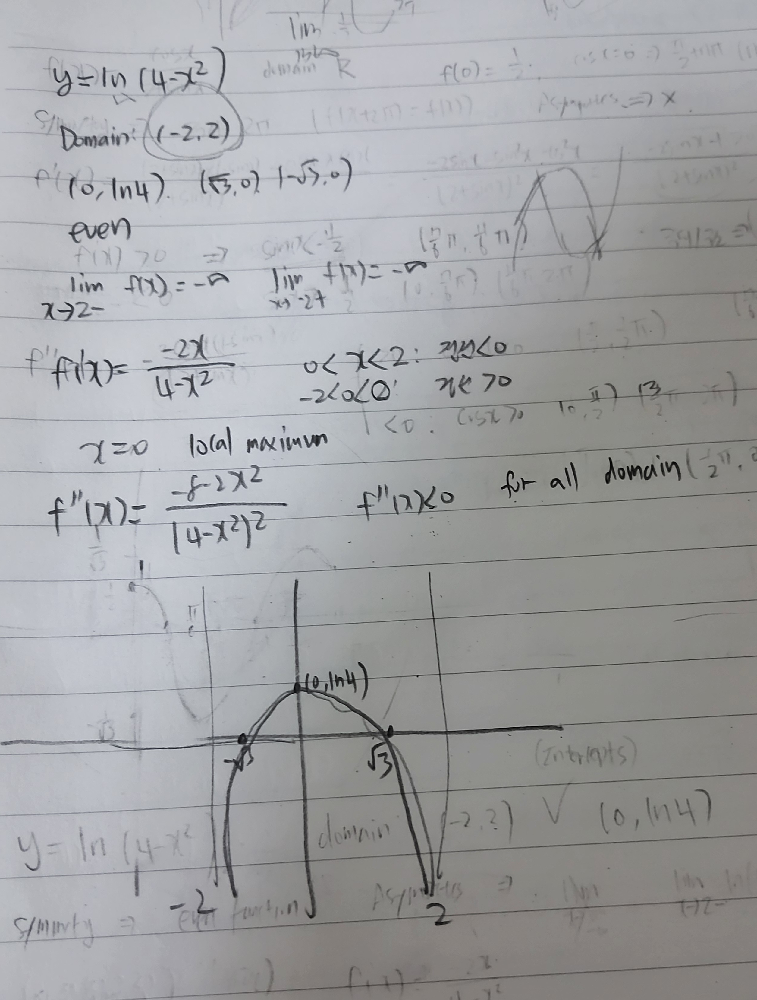

# Week 10 key point

## Things to know before

There are many Indeterminate Forms in limit condition.

Representatively, 0/0 and ∞/∞ forms exist.

Also, ∞/-∞, -∞/∞ -∞/-∞ are all classified as ∞/∞ form.

## L' hospital's Rule

If f and g have at least one interval at which there are all differentiable and g'(x) ≠ 0,

(when lim x->a, the interval is open interval including a, 

lim x->a+ : positive variable b's value(b>a) which at (a,b), it satisfies that condition should exist at least one.

lim x->a- : positive variable c's value(c<a) which at (c,a), it satisfies that condition should exist at least one.

lim x->∞  : positive variable m's value which at (m,∞), it satisfies that condition should exist at least one.

lim x->-∞  : negative variable m's value which at (-∞,m), it satisfies that condition should exist at least one.)

(a can be possibly excepted)

lim x->a+,a-,∞,-∞,a f(x) =0, lim g(x) = 0 or lim f(x) = +-∞, lim g(x) = +-, -+∞,

right side's limit value exists or +-∞,

lim f(x)/g(x) = lim f'(x)/g'(x)

ex) lim x->1 lnx/(x-1) -> (1/x)/1 = 1

**We can not assume the right side limit value exists when using L' hospital's Rule many times,**

**but, if the value finally exists, we can utilize the result.**

**If it is not, it doesn't mean it doesn't have limit value. We should use other way for checking whether the limit has value.**

## 0x∞, ∞-∞ form

There also exists other four Indeterminate Forms.

We will first deal with how to resolve 0x∞ and ∞-∞

**∞ x 0 : For resolving this form, we just change this to ∞/∞ or 0/0.**

ex: lim x->0+ xlnx = lim x->0+ (lnx)/(1/x) = 0 (∞/∞ form)

**∞-∞ : For resolving this form, we change this also to ∞/∞ or 0/0 through converting to a common denominator** 

lim x->1+ (1/lnx - 1/(x-1)) = lim (x-1-lnx)/(lnx(x-1)) (0/0 form)

## 0^0,  ∞^0, 1^∞ form

For resolving this, there are two ways.

1. using natural logarithm

2. using e^ln(~) (By properties of logarithms)

Also, Lastly utilize Theorem on limits of composite functions.

### Theorem on limits of composite functions

If function g has limit value (L) and f is continuous at L,

lim(f(g(x)) = f(limg(x)) = f(L)

Below is solution process of lim x->0+ (1+sin4x)^cotx.

Two ways are all uploaded.

**Using natural logrithm**

 

**using e^ln(~)**

 

## Factors for sketching graph effectively

1. Domain

2. Intercept

3. Symmetry

4. Asymptotes

5. f'

6. local maximum/minimum

7. f''

Below are examples of sketching graphs.

 

 

### Slant Asymptotes

Asymptotes can be oblique.

**Definition in function**

When y=mx+b exists(m ≠ 0), (condition : lim x-> ∞ (f(x)-(mx+b))=0)

y=mx+b is Slant Asymptotes

Slant Asymptotes always exists 

when the degree of the numerator is one greater than the degree of the denominator in rational function.

ex) f(x) = (x^2+x+2)/x-1 -> By long division, x^2+x+2 = (x-1)(x+2)+4,

f(x) = x+2 + 4/(x-1) -> x+2 is Slant Asymptotes

proof : lim x-> ∞ (f(x) - (x+2)) = ∞

