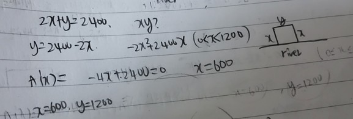
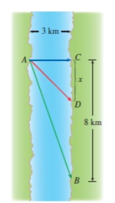
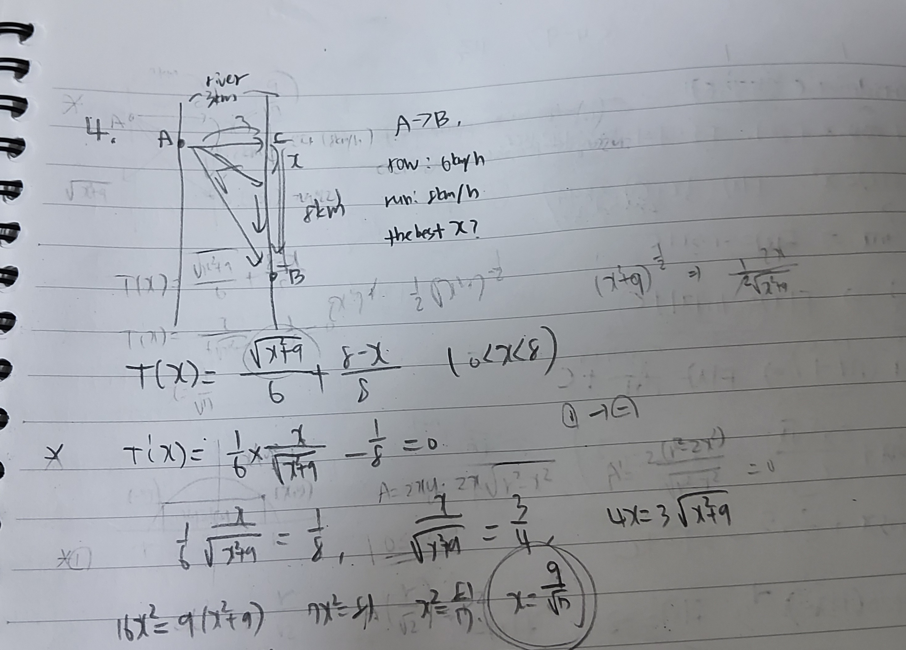

# Week 11 key point

## Optimization Problem

**The problem which uses function's extreme value for resolving real-world situation.**

ex 1) A farmer has 2400 ft of fencing and wants to fence o! a rectangular field  that borders a straight-line river. 

He needs no fence along the river. What are the dimensions of the field that has the largest area?

**solution**

 

ex 2)

 

A woman launches her boat from point A on a bank of a straight river. 3 km wide, 

and wants to reach point B, 8 km downstream on the opposite bank, as quickly as possible 

She could row her boat directly across the river to point C and then run to B, or she could row directly to B, or she could row to

some point D between C and B and then run to B. 

If she can row 6 km/h and run 8 km/h where should she land to reach B as soon as possible?

(We assume that the speed of the water is negligible compared with the speed at which the woman rows.)

**solution**

 

## Antiderivative

**if F' = f, F is f's Antiderivative.**

