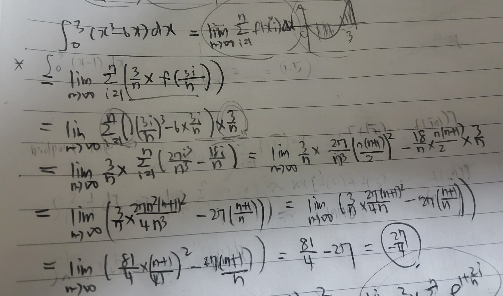

# Week 12 key point

## Things to know before

**Integration**

Actions for calculating independent variable's area about dependent variable in the function graph.

**Condition**
  
function should be continuous on [a,b] or have only a finite number of jump discontinuities.

First, I will introduce the method of exhaustion for calculating.

## Method of exhaustion

This is traditional way for calculating area using limit.

First, set [a,b] and divide an interval into n equal parts.

Next, make rectangle through deciding any point in interval.

The length of each equal part and dependent variable value by deciding point becomes width and length.

There are 4 ways for deciding point.

1. Right end point

2. Left end point

3. Mid point

4. Sample point(random point)

In this situation, Rn is used as dependent variable by n, and it means sum of area using right endpoint.

Also, $x_i^*$ and $\bar{x}_i$ are dependent variable by i, and it means each sample point and mid point in the i-th interval.

This sum of area is called as Riemann sum.

Also, if we only choose the sample point which makes maximize the function value, 

this Riemann sum result is also called as Upper sum, and the opposite one is Lower sum.

After deciding any point in each interval, if we use lim for making n-> ∞ condition,

we can calculate the interval's area.

## The Definite Integral

The calculated area is called as Integral.

We can define integral like this.

$\int_{a}^{b} f(x) \ dx = \lim_{n \to \infty} \sum_{i=1}^{n} f(x_i^*) \Delta x$

First, right side is the definition of the definite integral that we discussed earlier.

Left side is another signal which means integral.

These signals can only hold when integration condition is satisfied.

Also, the result about this equation always exists if the integration condition is satisfied.

As I dealt at week 04 deep dive, dx is symbol that do not conform to the definition.

So, we usually use left side signal just as a set without separation.

But, only in special situation such as integration by substitution,

we just use dx like it conform to the definition.

## Others about integral

Although above definition only holds on a<b, but mathematicians also defined the situation when a>b and a=b

$\int_{a}^{a} f(x) \ dx = 0$

$\int_{a}^{b} f(x) \ dx = -\int_{b}^{a} f(x) \ dx \quad (\text{for } a > b)$

**There are many other properties about integral.**

$\int_{a}^{b} f(x) \ dx = \int_{a}^{b} f(t) \ dt$

$\int_{a}^{b} c \ dx = c(b - a) \quad \text{where } c \text{ is any constant.}$

$\int_{a}^{b} [f(x) + g(x)] \ dx = \int_{a}^{b} f(x) \ dx + \int_{a}^{b} g(x) \ dx$

$\int_{a}^{b} cf(x) \ dx = c \int_{a}^{b} f(x) \ dx \quad \text{where } c \text{ is any constant.}$

$\int_{a}^{c} f(x) \ dx + \int_{c}^{b} f(x) \ dx = \int_{a}^{b} f(x) \ dx$

$\text{If } f(x) \ge g(x) \text{ for } a \le x \le b \text{ then } \int_{a}^{b} f(x)  dx \ge \int_{a}^{b} g(x) \ dx$

$\text{If } m \le f(x) \le M \text{ for } a \le x \le b \text{ then } m(b - a) \le \int_{a}^{b} f(x) \ dx \le M(b - a)$

**Problem solving of $\int_{0}^{3} (x^3 - 6x) \ dx$ using sigma**

 

