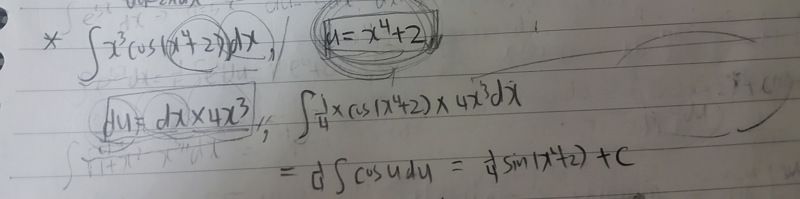
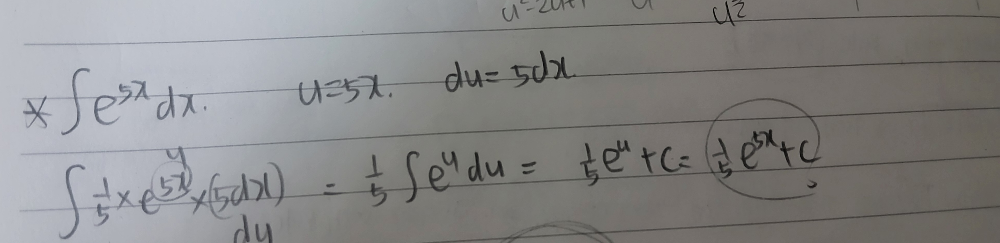
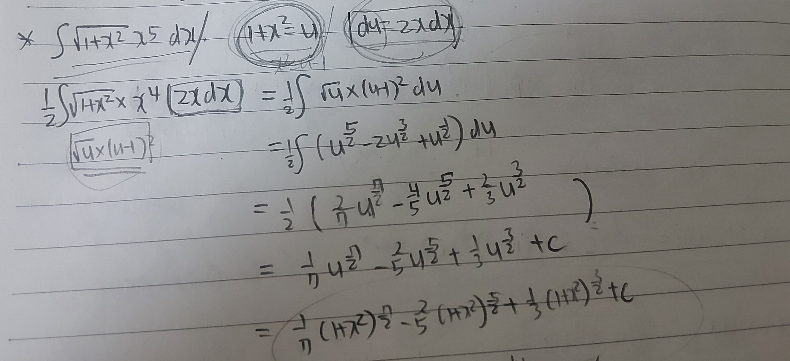
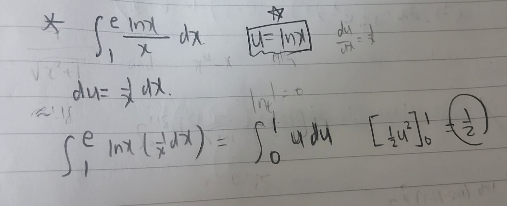
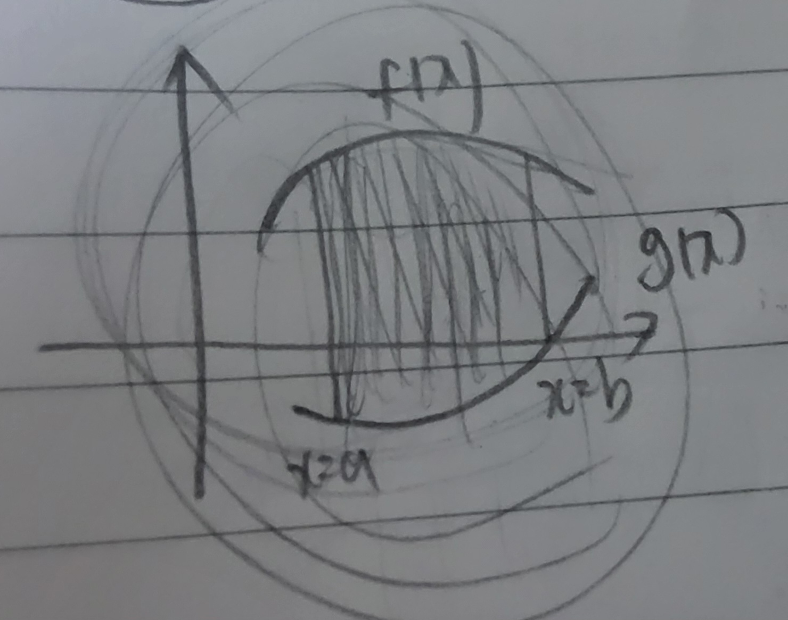
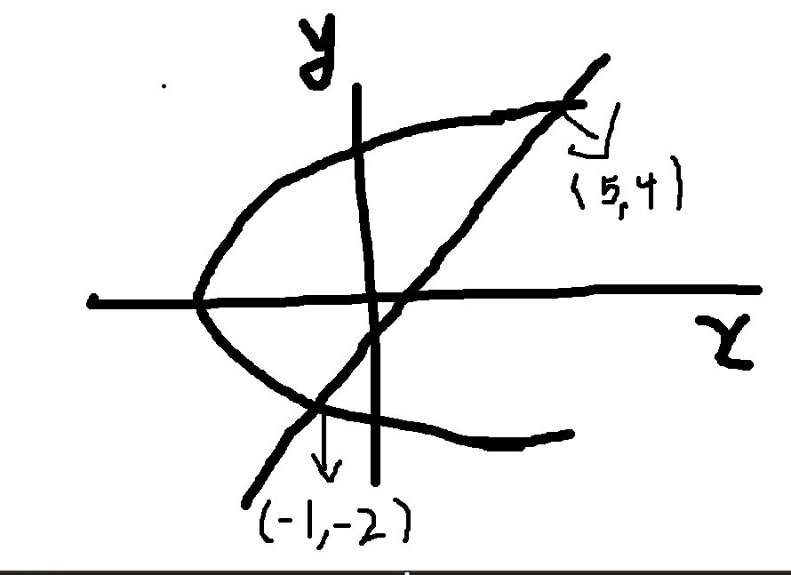

# Week 14 key point

## Substitution Rule for indefinite integral

**If g is differentiable on x range, and f is continuous on g range,**

By FTC1 & Chain rule,

$\int f(g(x))g'(x) \ dx = F(g(x)) + C$

In this situation, if we set u = g(x),

$\int f(g(x))g'(x) \ dx = \int f(u) \ du$

This is substitution rule for indefinite integral.

But, when analyzing above equation, g'(x) dx becomes du!!

Although in integral sign, dx is not original meaning, 

but we can change g'(x)dx to du when calculating as the result is same.

So, it is key point for calculating integral easily.

After substituting any part of equation to another variable,

if you change other part so that it satisfies substitution form,

we can easily calculate integral.

ex1)

 

As conditions of substitution rule for indefinite integral are satisfied,

(x^4+2 is differentiable for all real number x, cos function is continuous for all real number)

we can use substitution rule.

ex2)

 

As conditions of substitution rule for indefinite integral are satisfied,

(5x is differentiable for all real number x, e^ function is continuous for all real number)

we can use substitution rule.

## Substitution Rule of definite integral

**If g' is continuous on [a,b], and f is continuous on g range,**

By FTC1 & Chain rule,

$\int_{a}^{b} f(g(x))g'(x) dx = [F(g(x))]_{a}^{b}$

In this situation, if we set u = g(x),

$\int_{a}^{b} f(g(x))g'(x) dx = \int_{g(a)}^{g(b)} f(u) du$

This is substitution rule for definite integral.

Also, we can utilize this rule as we did before in indefinite section.

ex1)

 

As conditions of substitution rule for definite integral are satisfied,

((3-5x)' is continuous on [1,2], 1/(t^2) is continuous on [-7,-2], we assume t is f's domain variable)

we can use substitution rule.

ex2)

 

As conditions of substitution rule for definite integral are satisfied,

((lnx)' = 1/x is continuous on [1,e], t is continuous on [0,1], we assume t is f's domain variable)

we can use substitution rule.

## Other rules about definite integral

if f is continuous on [-a,a]

f : even function -> $\int_{-a}^{a} f(x) dx = 2 \int_{0}^{a} f(x) dx$

f : odd function -> $\int_{-a}^{a} f(x) dx = 0$

## Areas between curves

 

if f and g are continuous and f(x)>=g(x) on [a,b],

A = $\int_{a}^{b} \left[ f(x) - g(x) \right] dx$

ex)

**y = e^x, y = x, x = 0, x = 1, Area?**

∵ y = e^x and y = x are continuous on [0,1], e^x > x on [0,1],

A = $\int_{0}^{1} (e^x - x) dx$ = e-3/2

But, if the relative size relationship changes in between, 

we must divide the interval and evaluate it section by section.

ex) **y = cosx, y = sinx, $[0,\pi/2]$, Area?**

∵ on $[0,\pi/4]$, cosx > sinx.  on $[\pi/4,\pi/2]$, sinx > cosx.

A = $\int_{0}^{\frac{\pi}{4}} (\cos x - \sin x) dx + \int_{\frac{\pi}{4}}^{\frac{\pi}{2}} (\sin x - \cos x) dx$ = $2\sqrt{2}-2$

Also, function can be x = f(y), at this situation, we should do integration about y-axis. 

ex)

 

**y = x - 1 , y^2 = 2x + 6, Area?**

If we consider above two functions' domain variable as y,

x = y + 1 , x = (y^2 - 6)/2

by y axis, y + 1 > (y^2 - 6)/2 on [-2,4]

Therefore, A = $\int_{-2}^{4} \left[ (y+1) - \left( \frac{y^2-6}{2} \right) \right] dy$ = 18

## Course Conclusion

This marks the official completion of my MATH 113 course at GMU Korea. Thank you for visiting my portfolio!

