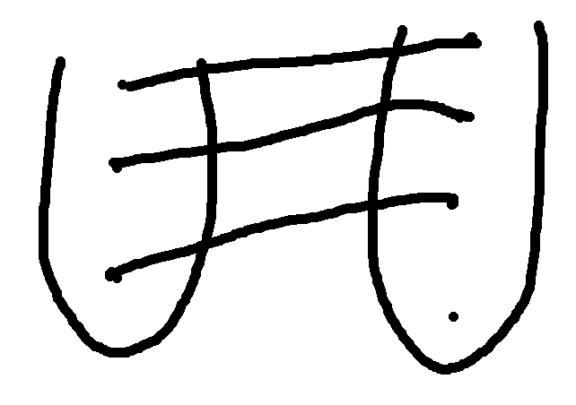
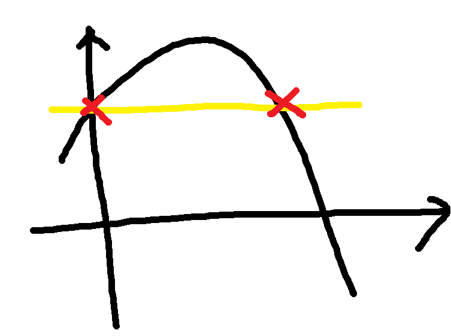

# Week2 key point -1

## Combinations of fuctions

    (f+g)(x) means that it adds two functions(about x) mathematically. and the result is same with f(x)+g(x)
    Like that, (f-g)(x)=f(x)-g(x), (f*g)(x)=f(x)*g(x), (f/g)(x)=f(x)/g(x).
    But, there are two cautions about that. First of all, when (f/g)(x), g(x) should not be 0.
    Second, the domain is intersection with two domains.

## Composition of functions

    Ths signal of composition is f ∘ g. it means f(g(x)). f ∘ g is not same with g ∘ f. 
    Domain f ∘ g is the set of all x in the domain of g, and also g(x) should be the domain of the f.

## One to one function and Inverse Fuction.

  
  One to One function means f(x1) is not equal f(x2) whenever x1 is not equal x2.  
  Especially, when codomain is same with range, we called it one-to-one correspondence.  
  The image above here is one to one fuction. it is not correspondence. But, we can control 
  codomains same with range to make it correspondence. So, when we make conditions related to that, we usually use one to one fuction. 
  
  When we want to check whether the fuction is one to one, we can use horizontal line.   If there are over two locations met with the graph,  it is not one to one. 
  Also, Inverse Fuction is the reverse with original fuction. the domain and range are changed each other.  The conditon for making inverse fuction is one to one. 
  The detail condition is correspondecne, but we can control codomain to make correspondence. 
  To make inverse fuction, First of all, write g=f(x), and solve the equation for x in terms of y, and change x and y.  
  f^-1(f(x))=x, f(f^-1(x))=x, but we should consider the domain related with inverse and composition.  

## the number e.

    e is one of the irrational number. it is approximately 2.7~. we can draw (y=e^x graph) simmlar with y=2^x.
    Also, we define ln. it means log which have a base "e". we can draw it also, and use many formulas related with log and exponent.
    

  
