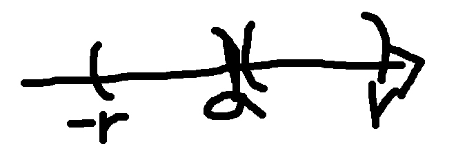

# Week2 keypoint-2

## Definiton of limit

  We usually think limit is just a situation. But, it is false. Limit is a constant. 
  
    We define f(x)->L, as x->a like these.
    
      1. Make open interval(x) except a (a-r,a),(a,a+r) 
      
      2. compress r to 0. 
      
      3. analyze all f(x) in the interval when compressing r to 0. 
      
      4. find the number when compressing. it is L. and it is constant. 

    Also, when x->∞ we define L like these. 

    the range of x-> infinity like this

    For any positive number M>0, all real numbers x such that x>M. (therefore, x is always positive)
    
     1. Suppose L is the value of limit. 
     
     2. Make random error for verifying whether L is the value of limit. 
     
     3. if L is 3, and error is 0.01, we should find M, which means all f(x) is range from 2.99 to 3.01 in x>M.
     
     4. Find M. if we can find all M with all error, L is the real value of limit. 

## definiton of infinity

 Infinity is not number, it is condition.

 Limit result can be infinity condition.
 
    We define positive infinity of function value like these.
    
      1. Suggest any positive 'M' for checking whether this condition is positive infinity.
      
      2. find the number 'a' which can make the number(L) over M. the number(L) can be evaluated like the same way which I used at defining f(x)->L, as x->a.
      
      3. If it exists 'a' even one with all M, this condition is positive infinity.

      (This infinity condition can have negative number for a moment unlike x->infinity condition.)
    

## Limit laws

   when all limits have constant values 

      1. lim (f(x)+g(x)) = lim f(x) + lim g(x)
      
      2. lim (f(x)-g(x)) = lim f(x) - lim g(x)
      
      3. lim (f(x)*g(x)) = lim f(x) * lim g(x)
      
      4. lim (f(x)/g(x)) = lim f(x) / lim g(x) ( lim g(x) is not same with 0)

## 5 ways for caculating limits

    1. numerically (with calculator)

    2. graphically (with graph)

    3. intuitively (f(x)=x^2->infinity, as x->infinity)

    4. use limit laws

    5. Indeterminate form

      
