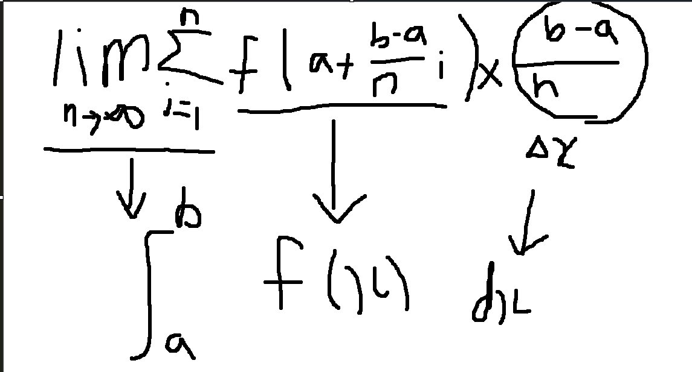

# Week 4 key point

## Algebraic Expression of Units

     Algebraic expression of units is a way for representing units algebraically. ex) m/s^2, km/h

     We utilize these with multiplication and divison. For understanding these, I recommend you to imagine v-t graph.

     Multiplying another units means many values made by area under the graph line. It is different with function value.

     ex) kg * m/s^2 , in this example, we can imagine graph(x axis : kg, y axis : m/s^2) and the value in area under the graph line is kg*m/s^2.

     Division means per. ex) m/s -> meter per second. As these means amount of change per second, it is slope of graph. (slope of tangent line and secant line)

     So, m/s means the slope of meter/second graph. In this expression, we freely caluclate each other. Slope of tangent line -> m/s /s -> m/s^2

     m/s * m = m^2/s but, although m^2/s is possible as theory, it is not used. Also, there are relationships between distance/velocity/time/acceleration.

     In distance-time graph, the slope is velocity, and in velocity-time graph, the area under the line is distance and slope is acceleration.
     
     The important thing is this expression is made considering these relationships.

     It can reflect that relationship like this. m(distance)/s(time) = velocity(m/s), m/s(velocity)/s(time) = acceleration(m/s^2).

     m/s(velocity) * s(time) = m(distance). Moreover, we can calculate each other for knowing what unit is for the slope, 

     but, if the unit is different, they can not calculate each other. Although it looks same in the graph, if the unit is different, it can't calculate each other.

     we can also use fuction for utilizing these relationships.

## Mathematical theories

    Equation of tangent line at (a,b) -> y-b = f'(a)(x-a)

    the size of domain f' <= the size of domain f.

    misunderstanding point : if x is domain, y=3 -> fuction, slope=0, x=3-> not fuction, slope -> doesn't exist.

    limit : if the limit value exists, left-hand limit should be same with right-hand limit. In the closed interval, 
    
    it is impossible to have limit value at end point.

    Differentiation : if the derivative exists, left-hand derivative and right-hand derivative should be same. In the closed interval, 
    
    it is impossible to have the derivative value at the end point.

    Continuity : if the fuction is continuous at x=a, the fuction should be left-continuous and right-continuous, but!!

    In the closed interval, the interval is recognized as continuity only if the both end points are either continious.

    the signal of derivative. -> f'(x), y', dy/dx, df/dx, D f(x), Dxf(x) (based on x)

    second derivative : f''(x), d^2y/dx^2

    If the fuction can differentiate at the interval, the fuction is continuous at the interval. (Reverse is not applied this law)

    3 reason why the function is impossible to differentiate

    1) discontinuous

    2) cusp point (ex: y=|x|, x=0), it is not smooth point. left-hand derivative is not same with right one.

    3) vertical tangent line : the slope is not defined.

## Leibniz's notation

    Leibniz defines dx and dy as infinitesimal number.

    But, this is not uncertain definition.

    Although Leibniz made derivative and integral signal,

    the meaning of those signal was uncertain.

    Mathematicians of later generations defines dx like this

    dx -> equation of tangent line delta x of function.

    dy -> equation of tangent line delta y of function.

    dx and dy are variables.

    also, x,y delta x, and delta y are also variables.

    We usually can use delta x like this -> delta x/delta y = 3 (usually)

    at x=2, delta x=0.05, f(x) ??

    Like this, we can use dx and dy.

    dy/dx = 3x^2 (usual definition) x means tangent point,

    but we usually write it as just x.

    As at one point, there is only one tangent line,

    so it is also function, and if we write its domain,

    it is same with f'(x).

    dy = 3x^2 * dx is possible.

    Also, if we consider only one tangent line, 3x^2 changes from variables to constants.

    **dx and dy is only for equation of tangent line.**

    we can do like this.

    In the tangent line at x=1, dy/dx?

    In the tange lint at x=1, also in x=3, dx=3, dy=?

    d(f(x)) or dy -> Equation of Tangent Line's delta y , original function = f(x),

    d(x^2+1) -> possible -> Equation of Tangent Line's delta y, origianl : x^2+1

    d/dx f(x) -> possbile, we sometimes use d/dx like derivative machine.

    this is same with d(f(x))/dx.

    d^2y/dx^2 = consider derivative as origianl function.

    dx^2 = delta x of Equation of Tangent Line of derivative.

    d^2y = delta y of Equation of Tangent Line of derivative.

    d^2y/dx^2=6x, d^2y = dx^2 * 6x.

    (x is tangent point)

    it is same signal with f''(x)

    If we define dx and dy like this, derivative has no problem.

    But, in integral, there are problems.

    

    As shown in the image above,

    changing that signals to integral and f(x) is appropriate.

    But, delta x -> dx is not natural.

    This is collusion of definition.

    It is enough to accept this situation as just collusion of definition between Leifnitz and Later mathematicians.

    Also, later mathematicians uses dx when using integration by substitution

    although the definition is not appropriate for using it in ingeration.

    In other words, the key point is

    1. There is definiton collusion between Leifnitz and Later mathematicians. (We dealed with later one in previous section.)
    
    2. It is correct that we consider dx and dy definition as later definition.

    3. By later defintion, derivative has no problem, but in integral, there are problems.

    4. For resolving this, considering situation(Integral siginal has been used for a long time),

       later mathmatician selected uses it origianlly, but make a new way (integration by substitution)

       for using dx like it satifies the definition.

       (integration by substitution is based on other math laws.

    

    

    

    

    

    

    

    

    

    

    

    

     

     
