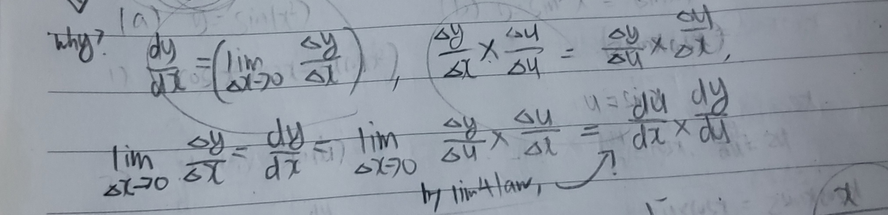

# Week7 key point

## Things to know before

**if f is continuous at a, and g is continuous at f(a),**

**g(f(a)) is continuous at a. (the range can be point, close interval and open interval).** 

**if f is derivative at a, and g is derivative at f(a),**

**g(f(a)) is derivative at a. (the range can be open interval)**

## Chain rules

**if g is derivative at a, and f is derivative at f(a),**

F(x) = f(g(x)), F'(x) = f'(g(x)) * g'(x)

ex) y=(2x+1)^3 -> y' = 3*(2x+1)^2 * 2 = 6*(2x+1)^2

Also, by Leibniz's notation,

dy/dx = du/dx * dy/du

**Proof**

 

We can utilize this notation.

1) y = (2x+1)^3 -> y' ?

   u=2x+1, y=u^3 -> use chain rule like above calculation.

2) dy/dx = du/dx * dy/du = 2 * 3u^2 = 6u^2 = 6(2x+1)^2

## Implicit Differentiation

**Explicit function : the form of y= ~ (it is not function, just form)**

**Implicit function : the form of etc. except y~ (it is also just form)**

The key point for resolving implicit differentiation is assuming 

there are differentiable function when we zoomed in the equation graph.

**ex1) x^2 + y^2 = 25 (it is not function, just equation)**

First, change y to f(x) (f(x) is assumed as differentiable function.)

x^2 + f(x)^2 = 25

we assume x^2+f(x)^2  as a new function (a(x)) because f(x) is already assumed as function.

25 is also function. (b(x))

Therefore, we consider that a(x) and b(x) are just each function which have y range.

As a(x) = b(x),  a'(x) = b'(x)

So, it is possible to do differentiation.

2x + 2f(x)f'(x) = 0 

f'(x) = - x / f(x)

It is condition for satisfying a'(x) = b'(x)

Ultimately, it is condition for satisfying a(x) = b(x)

If we consider this equation(a(x) = b(x)) as original equation,

for satisfying x^2 +  f(x)^2 = 25, f'(x) = -x/f(x) is the condition.

Therefore, we can know f'(x) = -x/f(x) if f(x) is differentiable function in equation.

f'(x) = -x/f(x) can be changed to y' = -x/y

In other words, simplifying the method, differentiate y like f(x) and simplify to y' = form.

**ex2)**

x^3 + y^3 = 6xy

3x^2 + 3y^2 y' = 6y + 6xy'

y' = (6y-3x^2)/3y^2-6x

### Detail about implicit function

Calculated y' holds true in every differentiable function in the equation.

We can maximize the function range for getting more y'.

The range which can not be differentiable can not use the y' result as analyzing the process for getting y' value,

it is impossible to go through the process as it can not be differentiable.

But, the range is filtered by y' results 

**ex**

x^2+y^2=25 , y' = -x/y, (5,0) -> impossible

The process for calculating y''

if y' = -x/y, we can also consider y' and -x/y as just each x function.

So we can differentiate.

y'' = - (y-xy')/y^2 = - 25/y^3

