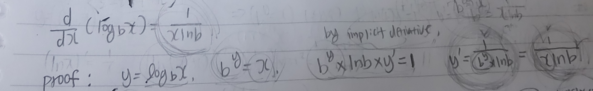
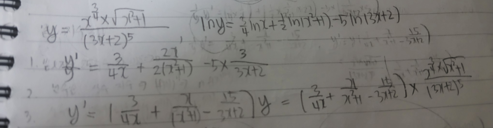
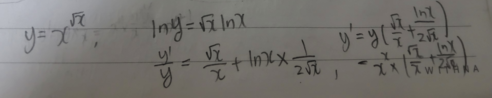
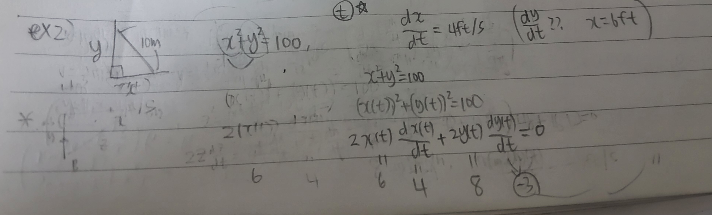

# Week 8 key point

## Derivatives of Logarithmic Functions

d/dx ($log_{b} x$) = 1/x lnb

Proof : 

 

By above formulas, d/dx (ln x) = 1/x

## Logarithmic Differentiation

If it is hard to calculate some math equations' derivative,

we can use logarithmic differentiation.

1) Change a=b equation to log equation (ln is recommended)

2) Use log Laws of logarithms and do implicit differentiation.

ex) 

There are four types of differentiation about exponent and base.

1. (5^3)' = 0

2. ((2x+1)^3)' = 3*(2x+1)^2*2= 6(2x+1)^2

3. 2^(3x+1) = 2^(3x+1) ln2 * 3

4. The case when exponent and base are all variables (ex : x^(rootx)) -> use logarithmic differentiation

 

## Inverse Trigonometric Functions

**sin^-1(x) = arcsin(x),  cos^-1(x) = arccos(x),  tan^-1(x) = arctan(x)**

**(sin^-1(x))' = 1/(root 1-x^2)),  (cos^-1(x))' = - 1/(root 1-x^2)), (tan^-1(x))' = 1/1+x^2**

Originally, making inverse trigonometric function is impossible.

**I will introduce the way we make inverse function of sin x and its derivative.**

First, we limit the range of the sin(x). ( [-ㅠ/2,ㅠ/2])

if we do that, inverse function can be function.

For calculating its derivative, just use implicit derivative 

as it can calculate slope although we don't need to consider whether it is function or not for now.

sin(y) = x, (inverse function)

y' = 1/cosy, cosy = +- root (1-sin^2y) = += root(1-x^2)

y' = 1/+-(root 1-x^2) -> y' value which includes the point before limiting the range.

As the range of y is [-ㅠ/2,ㅠ/2],

cos y becomes bigger than 0,

(Also, considering its shape)

y' = + root(1-x^2)

Other Inverse Trigonometric Functions and its derivative are also be calculated through this way.

## Related rates

The problem about calculating rates through related other given rates

There are two ways for resolving this kind of problems.

1) Use Leibniz's notation.

2) Use implicit function.

ex1)

Air is being pumped into a spherical balloon so that its volume increases at a rate of 100 cm3/s.

How fast is the radius of the balloon increasing when the diameter is 50 cm?

First, given condition : dv/dt = 100cm^3/s, unknown : dr/dt (when r=25)

V = 4/3ㅠr^2, dV/dr = 4ㅠr^2, 

By Leibniz's notation,

dV/dt = dV/dr * dr/dt

Therefore, 100 = 4ㅠr^2 * dr/dt

as r= 25, dr/dt = 1/25ㅠ cm/s

ex2)

A ladder 10 ft long rests on a vertical wall. If the bottom of the ladder slides away from the wall at a rate of 4 ft/s, 

how fast is the top of the ladder sliding down the wall when the bottom of the ladder is 6 ft from the wall.

 

First, we set two variables x and y.

By Pythagorean theorem, x^2+ y^2 = 100.

dx/dt = 4ft/s, dy/dt = ??? when x= 6ft.

x and y are all variables about t.

So we can use implicit derivative about t.

By, implicit derivative, we assume x as x(t), and y as y(t) (function about t)

x(t)^2 + y(t)^2 = 100

2x(t) dx(t)/dt + 2y(t) dy(t)/dt = 0

2 * 6 *4 + 2 * 8 * (???) = 0

therefore, **answer = -3ft/s**

## Linear Approximations

Sometimes, it is hard to calculate accurate function value.

So, we need to approximate this kind of values.

That way is linear approximation using tangent line.

Method is simple.

1) Calculate a tangent line about one point. this process is called as linearization.

2) Approximate through the tangent line. this process is called as Linear Approximations

ex 1) 

**Fine the linearization of the function f (x) = root x + 3 at a = 1 and use it to approximate root 3.98 and root 4.05.**

**Are these approximations over-estimated or under-estimated?**

First, f'(1) = 1/4, therefore, tangent line : L(x) = 1/4x+ 4/7

x -> 0.98 : 1.995 (approximations of root 3.98)

x -> 1.05 : 2.0125 (approximations of root 4.05)

Considering the graph's shape, tangent line is always above the function.

Therefore, they are all overestimated.

ex 2)

The radius of a sphere was measured and found to be 21 cm with possible error in measurement of at most 0.05 cm.

What is the maximum error in using this value of the radius in computing the volume of the sphere? (approximation)

V = 4/3 ㅠ r^3, dV/dr = 4ㅠr^2, as dV and dr are also independent variables,

dV = dr * 4ㅠr^2. **dV = 0.05 * 4ㅠ * 21^2 = 88.2ㅠ**

